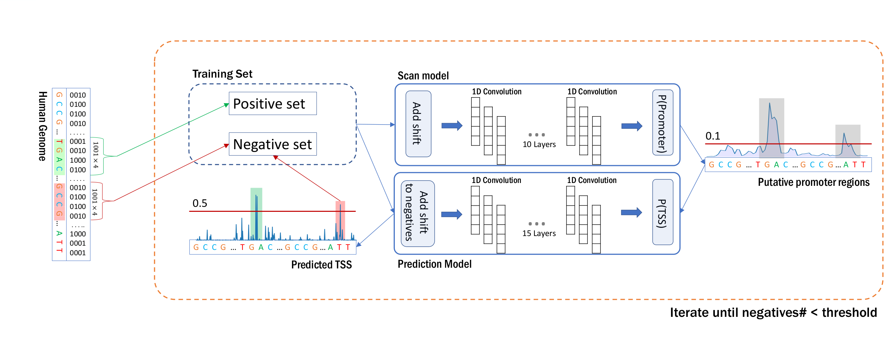

# ReFeaFi: Genome-wide prediction of regulatory elements driving transcription initiation

Workflow of ReFeaFi for genome-wide regulatory elements prediction. The scan model uses a sliding window approach to pick putative promoter regions. The prediction model finds TSS positions inside these regions by testing each position. The false positive predictions made by the second model are added to the negative set. The whole process is repeated several times to generate a difficult negative set which forces the model to learn how to distinguish the difficult negatives from the real regulatory sequences.

## Installation

Simply clone this repository and run predict.py to use the pre-trained models. 
ReFeaFi requires ```tensorflow==1.7.0```:
```sh
pip install tensorflow==1.7.0
```
OR
```sh
pip install tensorflow-gpu==1.7.0
```
for the GPU version. In this case you also need to install CUDA9 and cuDNN7. 
## Usage
ReFeaFi can be run from the command line:
```sh
python predict.py -I hg19.fa -O human_regulatory_regions.gff -C chr20 -T 0.8 -D 5000
```
Required parameters:
 - ```-I```: Input fasta file.
 - ```-O```: Output gff file.

Optional parameters:
 - ```-D```: Minimum soft distance between the predicted TSS, defaults to 1000.
 - ```-C```: Comma separated list of chromosomes to use for prediction, defaults to all.
 - ```-T```: Decision threshold for the prediction model, defaults to 0.5.
 
The predictions for the six species from the study can be downloaded directly from [predictions.zip](https://drive.google.com/file/d/1t3qF35SdimANuzRNstGpse3OoWhc1i_X/view?usp=sharing) 
 
To calculate dependency score used for the pair maps, run dependency_score.py:
```sh
python dependency_score.py promoters.fa 495:505 460:475 
```
The first parameter is a FASTA file and the next two represent regions of interest. 

## Reproducibility
Please install the following packages:
```sh
pip install biopython==1.70
pip install liftover==1.0.1
pip install pandas==1.0
pip install matplotlib
pip install seaborn
```
To train the models, download the [data](https://drive.google.com/file/d/1e6OPPZCOSMTA-ef5nF5xC_heLyklSntW/view?usp=sharing) and extract it to some location. Add this path (**parent folder of the data folder**) to the data_dir file in the project root. 
For example:

/home/user/Desktop/test/   
put '/' at the end. 

Download human genome FASTA (hg19.fa) and put it into *data_dir*/data/genomes/ folder. Run the following commands to generate the models:
```sh
python train_p_e.py model_predict 0
python train_p_e.py model_scan 1
python train_strand.py model_strand
```
Put all three of them into *data_dir*/models/ folder. Make predictions on the human genome to find hard negatives:
```sh
python predict.py -I data/genomes/hg19.fa -O human_negatives.gff -M 0 -T 0.5
```
-M 0 indicates that true regulatory regions will be skipped. 
Next, add new negatives to the negative set:
```sh
python add_negatives.py
```
Repeat these commands starting from training scan and prediction models several times to generate the final models. The data used to train our final models can be downloaded directly: [training_data](https://drive.google.com/file/d/1sodoR286E4BuI_znd-_3z13STPpQEk1k/view?usp=sharing).

Run scripts in 'validation' folder to reproduce the experiments described in the paper:
* performance_human_chr1.py: Performance comparison of ReFeaFi and alternative methods on human chromosome 1
* performance_species.py: Performance of ReFeaFi on 6 different organisms
* predict_vista.py: Discrimination between vista enhancers and random genomic regions
* synthetic_promoters.py: Calculates correlations between measured expression and predicted score for the synthetic promoters
* variants_overlap.py: Finds overlap of predictions with variants from ClinVar and GWAS
* tf_case_study.py: Calculates dependency between JUND and BATF binding motifs inside the regulatory regions

The above-mentioned scripts generate output in the 'figures_data' folder which can be visualized by running scripts in the 'figures' folder of this repository. The produced images will be placed in the 'figures' folder inside the specified *data_dir* folder.

The model analysis (Mutation maps, Pairs maps, and important motifs) was performed using scripts from the following repository:
https://github.com/umarov90/PromStudy